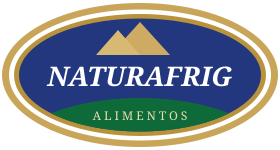

  

<h1 align="center">Naturafrig Sistemas</h1>

  <b>Tecnologia da Informação · Naturafrig Alimentos</b> 
  Tecnologia a serviço da operação, das pessoas e de cada unidade.

  
  

---

## 🏢 Quem somos

Somos a área de **Tecnologia da Informação da Naturafrig Alimentos**. Cuidamos dos sistemas, da infraestrutura e das integrações que mantêm as unidades conectadas e a operação rodando, do escritório ao chão de fábrica.

Desenvolvemos soluções próprias quando o mercado não atende e integramos as ferramentas que a empresa já usa, sempre pensando em quem está do outro lado da tela.

---

## 🧭 Nossas frentes

| | Frente | Foco |
|---|---|---|
| 💻 | **Sistemas internos** | Ferramentas sob medida para comunicação, gestão e o dia a dia das áreas. |
| 🔗 | **Integrações** | Conectar os sistemas da empresa entre si, evitando retrabalho e dado duplicado. |
| 🌐 | **Infraestrutura e redes** | Servidores, redes e conectividade entre as unidades, com disponibilidade e monitoramento. |
| 🔐 | **Segurança da informação** | Proteção de dados, controle de acesso e boas práticas alinhadas à LGPD. |
| 🎧 | **Suporte e atendimento** | Atendimento aos usuários e melhoria contínua a partir do que o dia a dia mostra. |
| 📊 | **Dados e automação** | Automatizar tarefas repetitivas e transformar informação em decisão. |

---

## 🤝 Como trabalhamos

- **Segurança primeiro:** acesso controlado, dados protegidos e responsabilidade com a informação.
- **Simples para quem usa:** tecnologia boa é a que facilita o trabalho, não a que complica.
- **Feito para as unidades:** cada filial com suas particularidades, sem perder a visão do todo.
- **Melhoria contínua:** ouvir, ajustar e evoluir, com mudanças versionadas e testadas antes de ir para produção.

---

## 🛠️ Tecnologias

---

  <i>"Tecnologia boa é a que soma no dia a dia: a pessoa só percebe que tudo funciona."</i>

  

